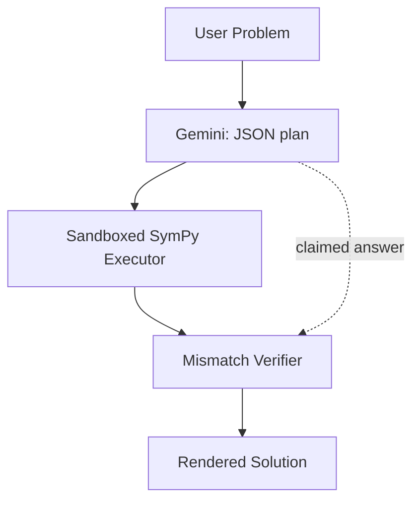
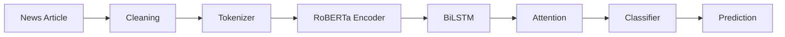

 

 

  

  

 

---

## About

Computer Science undergraduate at **IIIT Pune**. I build AI systems that go past the notebook stage — full applications with a backend, a frontend, and reasoning that holds up under real inputs, not just curated demo prompts.

**`EquationAI`** and **`FactsAI`** are where most of that shows: a neuro-symbolic math reasoning platform and a hybrid transformer + RNN pipeline for fake news detection. Both are shipped, not just prototyped.

> I care most about the layer between *"the model works"* and *"the model is verifiably correct"* — the difference between an LLM sounding confident and a system that actually checks its own answers.

 

---

### Flagship Project

# 🧮 EquationAI

**Neuro-symbolic math problem solver**

Combines LLM reasoning with deterministic SymPy computation for verified, step-by-step solutions — not just plausible-sounding ones.

 

 

**Why it's technically interesting**

LLMs are fundamentally unreliable at arithmetic and symbolic manipulation — they predict plausible tokens, not verified calculations. EquationAI splits the problem across two components that play to different strengths: **Gemini** reads the natural-language problem and decomposes it into a structured JSON plan (variables, steps, SymPy expressions), while a **sandboxed SymPy engine** executes every step's actual math. The final answer a user sees was computed, not generated by the model.

To close the remaining gap, a **mismatch verifier** independently compares the LLM's own stated answer against SymPy's computed result — using numeric comparison first, and falling back to symbolic simplification (`sympy.simplify(a - b) == 0`) for expressions containing free variables, like general solutions to differential equations.

 

<table>
<tr>
<td width="50%" valign="top">

**Core Features**

| | |
|---|---|
| 🧠 | LLM parses problems into structured, executable plans |
| 🧮 | Deterministic SymPy computation — never LLM-generated arithmetic |
| ✅ | Independent mismatch verifier cross-checks every answer |
| 🔒 | Sandboxed execution — `__builtins__` stripped, only SymPy exposed |
| 📐 | LaTeX-rendered step-by-step output via KaTeX |

</td>
<td width="50%" valign="top">

**Architecture**

</td>
</tr>
</table>

 

**Evaluation**

A resumable evaluation harness covers **22 problems across 14 categories** — arithmetic, algebra, unit conversion, probability, combinatorics, coordinate geometry, linear algebra, series, differential equations, and substitution-trick integration. It also includes deliberately ambiguous inputs to test whether the system correctly recognizes when *not* to answer.

**Result: 22/22** — 19 auto-verified, 3 manually confirmed correct (multiple valid equivalent forms).

**Tech Stack**

 

---

 

### 📰 FactsAI

Research Project — Hybrid RoBERTa–BiLSTM Fake News Detection

<table>
<tr>
<td width="60%" valign="top">

A hybrid deep learning system combining **RoBERTa** contextual embeddings with a **BiLSTM** and **additive attention mechanism** for fake news classification, served through a Streamlit interface. Trained on a merged **ISOT + LIAR + Kaggle** dataset.

**Model Pipeline**

</td>
<td width="40%" align="center" valign="top">

 

<

</td>
</tr>
</table>

 

---

## Tech Stack

<table>
<tr>
<td valign="top" width="33%">

**Languages**

**AI & LLM**

`Transformers` `Hugging Face`
`LangChain` `RAG`
`Gemini API` `NLP`
`Scikit-Learn`

</td>
<td valign="top" width="33%">

**Backend**

**Frontend**

</td>
<td valign="top" width="33%">

**Developer Tools**

</td>
</tr>
</table>

 

---

## Current Focus

<table>
<tr>
<td width="33%" valign="top">

**Building**

EquationAI v2 — public deployment, 3D geometry & multi-part problem coverage

</td>
<td width="33%" valign="top">

**Research**

Model Context Protocol (MCP)
LangGraph

</td>
<td width="33%" valign="top">

**Learning**

Advanced RAG architectures
LLM evaluation & benchmarking

</td>
</tr>
</table>

 

---

## GitHub Overview

 

 

 

---

## Connect

Building AI systems that are reliable, scalable, and solve real problems.

